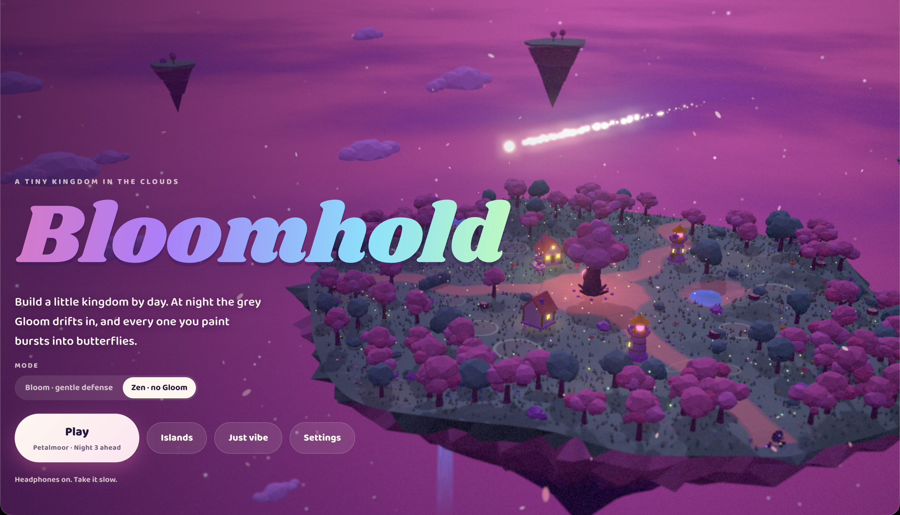

<div align="center">

# 🌸 Bloomhold

**A tiny kingdom in the clouds.**

Build by day. When night falls, the grey Gloom drifts in, and every one you paint bursts into butterflies.

*A chill, candy-colored kingdom builder.
Made to feel good slowly. Headphones on.*

**[▶ Play in your browser](https://YOUR-USERNAME.github.io/bloomhold/)**

<br>



</div>

---

## What it is

Bloomhold is a relaxed, low-poly tower defense you can play in any modern browser. You ride a fluffy creature called Floof across floating islands. By day you spend glowing sparks to grow a little kingdom. At night, soft grey creatures called the Gloom wander in along the paths, and your towers, lanterns and friends paint them back into color.

Nothing is ever lost for good. If the Gloom drains a building, it goes grey and regrows at dawn. There's no game over. If you want no enemies at all, there's **Zen mode**.

## Features

- **Five floating islands**, each with its own palette, weather and musical key: Petalmoor (blossoms), Tidebloom (coral and rain), Emberwood (autumn leaves), Frostglow (snow and aurora) and Prismara (every color at once).
- **A full day-night light show**, from a candy sunrise through golden hour to a neon-violet night with stars, fireflies and aurora.
- **Seven buildings with three levels each:** cottages, flower fields, Paint Towers, Lumen Lanterns, Bloom Hedges, Sprite Groves and Chime Spires.
- **A generative soundtrack** that is synthesized live. It changes between day, dusk, night and battle, and every sound effect is tuned to the current key.
- **Musical toys everywhere:** riding through flowers plays them like chimes, clicking anything makes it wobble and sing, and you can catch shooting stars for a wish.
- **Vibe mode:** hide the UI, let the camera drift and watch time flow.
- **Gentle onboarding** that teaches one goal at a time, with range previews, threat previews and off-screen arrows.

## Controls

| Input | Action |
| --- | --- |
| `WASD` / arrow keys | Ride |
| `Space` (hold) | Pay sparks into a glowing plot to build or upgrade. Hold at the Heart to call the night |
| `Shift` | Dash |
| `E` | Bloom Burst: paints nearby Gloom and rings the flowers around you |
| Combos | **Petal Strike:** dash through Gloom at night. Chain 5 paints and press `E` for **Bloom Nova** |
| `Enter` | Begin the night |
| `R` (at the Heart) | Spend sparks to restore every building the Gloom wrecked |
| `V` | Vibe mode |
| `M` | Island map |
| `Tab` (hold) | Peek at the whole island |
| `F` / `H` | Fullscreen / hide HUD |
| Mouse | Click the ground to ride there, hold to steer, click things to wobble them |
| Controller | Stick rides, A builds, B dashes, X bursts, Y calls the night, RB peeks |
| Touch | Drag on the left half to ride and use the on-screen buttons |

**Comfort options** are under Menu → Settings: tap-once building (no holding), a gentle night pace, reduce motion (follows your system setting), large text, and guide tips on or off.

## Run it locally

It's a single static file with no install and no build step.

```bash
git clone https://github.com/YOUR-USERNAME/bloomhold.git
cd bloomhold
open index.html          # or: python3 -m http.server, then visit localhost:8000
```

The first load needs internet to fetch Three.js and the fonts from CDNs. Progress saves in your browser.

## How it's made

Everything is code. There are **no image, model or audio files**.

| | |
| --- | --- |
| **Rendering** | [Three.js](https://threejs.org) r160 with bloom, plus a custom shader for tilt-shift, hue drift and color grading |
| **Shaders** | Custom GLSL for the sky, stars, cloud sea, aurora, rainbow, water, waterfalls and wind-swayed grass |
| **World** | Procedurally generated islands, paths and terrain. Every tree, building, creature and critter is built from primitives at runtime |
| **Sound** | Web Audio API: generative pads, kalimba, bells, soft percussion, reverb and ambience, all synthesized live |
| **UI** | Plain HTML and CSS, with Shrikhand and Baloo 2 from Google Fonts |
| **Tooling** | No framework, no npm. A small Python script bundles the modules into one `index.html` |

### Project layout

```
index.html        the whole game, ready to play or deploy
build.py          bundles src/ into index.html
src/
  shell.html      page, styles and HUD
  00_core.js      utilities, island palettes, tuning, save, input
  audio.js        generative music and sound effects
  models.js       procedural low-poly models
  10_world.js     renderer, post-processing, sky, time of day, island generation
  20_fx.js        particles, sparks, butterflies, fireflies, weather, shooting stars
  30_entities.js  player, buildings, the Heart, the Gloom, villagers, critters
  40_game.js      game flow, waves, camera, UI, onboarding, vibe mode, travel
```

After editing anything in `src/`, rebuild with:

```bash
python3 build.py
```

## Deploy

`index.html` is fully static, so it runs anywhere: GitHub Pages (Settings → Pages → deploy from `main`, root), Netlify Drop, Vercel, Cloudflare Pages or itch.io.

---

<div align="center">

*Paint the Gloom back into color. Take it slow.* 🦋

</div>
